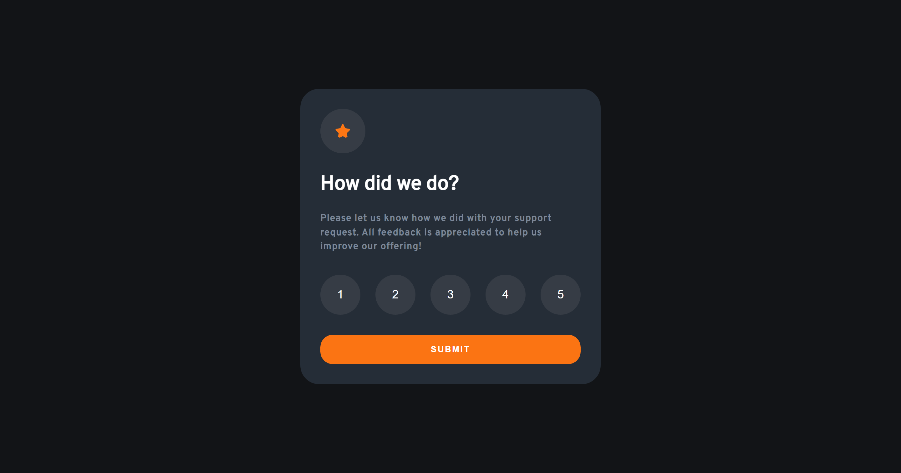

# Frontend Mentor - Interactive rating component solution

This is a solution to the [Interactive rating component challenge on Frontend Mentor](https://www.frontendmentor.io/challenges/interactive-rating-component-koxpeBUmI). Frontend Mentor challenges help you improve your coding skills by building realistic projects.

## Table of contents

- [Overview](#overview)
  - [The challenge](#the-challenge)
  - [Screenshot](#screenshot)
  - [Links](#links)
  - [Built with](#built-with)
  - [Author](#author)

**Note: Delete this note and update the table of contents based on what sections you keep.**

## Overview

### The challenge

Users should be able to:

- View the optimal layout for the app depending on their device's screen size
- See hover states for all interactive elements on the page
- Select and submit a number rating
- See the "Thank you" card state after submitting a rating

### Screenshot

### Links

- Solution URL: [Solution URL here](https://github.com/tehseen01/Interactive-rating-component.git)
- Live Site URL: [Live site URL here](https://tehseen01-interactice-rating-card.netlify.app/)

### Built with

- Semantic HTML5 markup
- CSS custom properties
- Flexbox
- CSS Grid
- vanilla js
- Mobile-first workflow

## Author

- Frontend Mentor - [@yourusername](https://www.frontendmentor.io/profile/tehseen01)
- Instagram - [@tehseen.01](https://www.instagram.com/tehseen.01)
